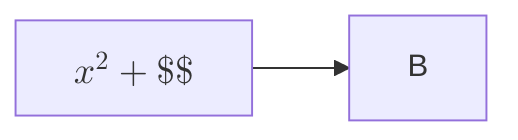

# Mermaid 내부 TeX 경계와 오류 격리 검토 — 2026-09-09

현재 작업 트리의 기존 수정(`13a2490`)과 회귀 검사를 먼저 확인한 뒤,
Mermaid 라벨 내부의 LaTeX 문법을 추가로 검토했다. 기존 필수 회귀 검사는
551개 모두 통과했지만, 아래 정상 입력 두 종류는 실제 Chrome에서 실패했다.

## 재현 및 수정

| 입력 | 수정 전 실제 결과 | 수정 후 |
|---|---|---|
| 흐름도 라벨 안의 여러 줄 `aligned` 수식 | 그림은 있지만 MathML이 0개이고 TeX 원문이 표시됨 | 줄바꿈을 포함한 전체 수식을 MathML로 조판 |
| `$$x^2+\verb\|$$\|$$`와 같이 verb 안에 달러가 있는 수식 | 내부 달러를 닫는 구분자로 읽고 KaTeX 오류가 발생해 그림 전체가 코드로 되돌아감 | verb 내부를 건너뛰고 실제 닫는 구분자까지 보존 |
| 미지원 수식 라벨 → 정상 수식 라벨 → 정상 노드 | 미지원 수식 하나 때문에 그림·정상 수식이 모두 사라짐 | 해당 라벨에 오류 번호를 표시하고, 그림 아래에서 정확한 원문을 펼쳐 볼 수 있음 |
| 표 셀의 목록 → 그림 → 오류 원문 안내 | 목록 기호가 그림 아래의 원문 안내로 내려감 | SVG를 밀지 않는 첫 기준선을 마련해 기호를 그림 위에 유지 |

실제 verb 재현 원문은 다음과 같다.

````markdown

````

`mermaidMathExpressions`의 한 줄 정규식을 제거하고, Markdown 본문에서 쓰던
`closingMathDelimiter`를 공통으로 사용한다. TeX 주석·이스케이프·verb를 같은
규칙으로 처리하며 기존 탐색 길이 상한도 유지한다. 여러 줄 수식의 줄바꿈을
제거하거나 내용을 추측해 고치지 않는다.

수식 후보가 라벨인지 여부는 계속 실제 Mermaid 파서가 결정한다. 주소·툴팁·
접근성 설명·주석·설정·식별자는 수식으로 변환하지 않는다. 렌더 실패는 해당
라벨에만 적용하고, 오류 원문은 React의 텍스트 자식으로 출력한다. MathML을
만드는 KaTeX 설정과 Mermaid의 자원 요청 제한은 기존 경로를 유지한다.

## 검증 범위

- 기존 연결·라벨·shape·수식 조합에 verb와 실패 라벨을 추가했다. 20개 Mermaid 입력 ×
  외부 컨테이너 5종 × 실제 개행 3종 × 코드펜스/직렬화 표 셀 2종 = 600개 입력에서
  코드 원문, 이웃 셀, 임시 토큰 유무를 확인한다.
- 여러 줄 수식·TeX 주석·verb 두 형식·이스케이프 달러를 LF/CRLF/CR에서 검사한다.
  실제 KaTeX로 원문이 유효함을 확인하고, 뒤의 독립 수식과 경계를 대조한다.
- 여러 줄 흐름도를 목록·인용·각주 등 6종 컨테이너와 실제 개행 3종에서 검사한다.
- 실제 앱 42개 사례를 1,000px·320px에서 검사한다. 총 84회이며 기존 74회에
  verb·오류 라벨 4회와 여러 줄 수식의 개행별 6회를 추가했다. SVG·노드·MathML의
  내용과 크기, 분수, 정확한 오류 원문, 목록 기호 좌표, 이웃 셀, 페이지 넘침,
  링크·접근성 제목, 콘솔 오류를 확인한다. 이 검사는 production 필수 검사에도 포함된다.
- 새 Chrome 스트리밍 검사는 본문 수식·인용·표·목록·차트·Mermaid를 함께 수신한다.
  verb와 미지원 명령 중간에서 조각을 나누고, 앞 수식 보존·완료 그림 3개·정상
  MathML 3개·오류 원문 1개·차트·이웃 셀·모바일 넘침·홈 리셋을 확인한다.

중간 검사의 스트리밍 판정은 아직 백틱이 닫히지 않은 조각에도 수식 오류가
없어야 한다고 요구했다. 미완성 문법의 임시 표시와 완료된 코드의 의미를
구분하도록 수정했다. 앞의 완성 수식과 원문 토큰 보존은 모든 조각에서 확인하고,
모든 코드가 닫힌 미리보기에서는 임시 수식 오류가 없어야 한다.

개발 화면 84회와 새 스트리밍 검사는 모두 통과했다. 데스크톱·모바일 캡처에서
verb 달러 원문, 정상 수식, 실패 라벨 안내와 목록 기호의 실제 배치를 확인했다.

## 최종 검증

실행 명령:

```sh
npm --prefix backend test
npm --prefix frontend run test:regression
```

최종 전체 실행은 백엔드 569개, 프런트엔드 단위 320개, Chrome UI 88개,
production 3개가 모두 통과했다. 실패·취소·건너뜀은 0개다. 필수 회귀 실행기는
백엔드 경계 144개를 포함해 555개이며, production에는 위의 실제 화면 조합
84회가 포함된다. `git diff --check`도 통과했고 임시 probe 파일은 제거했다.

완료 판정에 사용하는 증거는 다음과 같다.

| 요구 동작 | 현재 소스의 검증 경로 |
|---|---|
| LaTeX·Markdown·차트·Mermaid의 중첩 구조와 원문 보존 | `rendering-combinations`, `nested-boundaries`, `syntax-ownership`, `cell-blocks`, `mermaid-math` 단위 검사 |
| 조회 주입이 코드·수식·표·주소의 경계를 침범하지 않음 | 백엔드 `chart`, `markdown-syntax`, `llm-openai` 및 실제 조회값을 넣은 배포 사례 |
| 오류가 이웃 콘텐츠를 삼키지 않음 | 수식 오류 격리, 실패 라벨 원문·정상 그림, 이웃 행·셀 검증 |
| 스트림의 조각·완료·리셋·재시도가 서로 오염되지 않음 | 전체 Chrome UI 검사와 새 혼합 Mermaid 스트리밍 검사 |
| 작은 화면·인쇄·배포에서 내용과 실제 그림이 읽힘 | Chrome UI의 200개 수식 표·링크 표·인쇄 검사, 배포 빌드 84회 교차 검사 |
| 임시 토큰·잘못된 링크·자동 이미지 요청을 만들지 않음 | 단위 검사의 원문 대조, 실제 앱의 DOM·링크·콘솔·자원 요청 검사 |

이번 검토는 기존에 지원하는 Markdown·수식·시각화의 중첩 계약을 대상으로 한다.
Mermaid 문법 자체가 잘못된 경우는 전체 코드 원문으로 돌아가며, 지원하지 않는
TeX 명령을 추측해 정상 수식으로 바꾸지 않는다. 임의의 모든 입력·브라우저에
대한 무결점 보장을 뜻하지 않는다.
