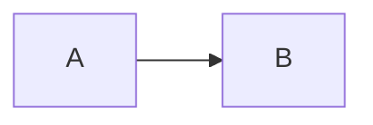
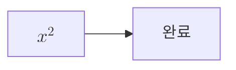
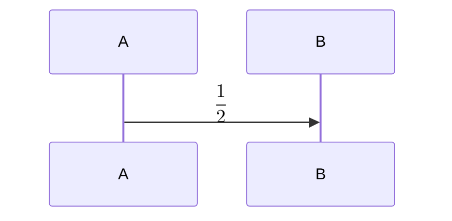

# LaTeX·Markdown·차트·Mermaid 조합 정밀 검토

최초 검토 기준은 커밋 `42e506b28d31405c822d8fd6f1967caeb3b1e0e4`다.
Node `v25.9.0`, 로컬 Chrome, 1000px·320px 화면으로 확인했다.
아래 1–5번 설명과 최초 검사 표는 수정 전 재현 기록이다.

2026-09-09 사용자 요청에 따라 다섯 항목을 수정하고, 표 셀의 이스케이프된 `<br>`,
직렬화된 Mermaid/chart 코드, 이중 이스케이프된 근의 공식까지 처리했다.
줄바꿈 뒤 목록은 실제 목록으로 렌더링하며, 차트 내부의 파이프가 바깥 표의 열을 늘리지 않도록 보호한다.
한 셀 안의 수식·강조·목록·인용문과 설명 사이의 시각화, 표 밖의 독립된 `mermaid<br>…`도 지원한다.
직렬화된 표 셀/독립 차트의 `data: step N`도 서버가 채우며, 조회값의 파이프·백슬래시·`<br>`를 보존한다.
생성 지침에는 표 행을 한 줄로 완결하고 빈 셀 뒤로 본문을 빼지 않도록 명시했다.
데이터가 없는 차트는 “표시할 데이터가 없습니다”로 안내한다. 사라진 수식 명령이나 조회값을 추측해 채우지 않는다.

기존 정식 회귀 검사 462개와 백엔드 chart 검사 36개는 모두 통과했다. 추가한 정상 조합 840개도 통과했다.
하지만 오류 격리, Markdown 컨테이너의 데이터 참조, 각주 식별자에서는 실제 결함을 확인했다.
Mermaid 안의 수식과 공백 없이 붙인 달러 수식에는 별도의 호환 제한이 있다.
개발 화면과 현재 소스를 새로 빌드한 production 화면 모두 같은 결과였다.

**우선순위와 확인된 결과**

| 우선순위 | 조합 | 실제 결과 |
| --- | --- | --- |
| P1 | 미완성 `\[`·`\(` → Markdown/차트/Mermaid → 다음 정상 수식 | 사이 콘텐츠와 다음 수식이 접힌 오류 상자 하나로 들어감 |
| P2 | 인용문 또는 목록 첫 줄 코드펜스 + `chart data:` / `table step:` | 조회 결과가 있어도 데이터가 채워지지 않음 |
| P2 | 각주 식별자에 `$x$`·`\(x\)` 등 포함 | 각주 참조가 원문으로 남고 각주 본문이 사라짐 |
| P2·호환 제한 | `flowchart` 노드 라벨의 `$$...$$` | 수식 대신 달러·TeX 원문 표시. `sequenceDiagram`의 수식은 렌더링됨 |
| P3·경계 문법 | `$x$$y$`처럼 인라인 수식 두 개를 공백 없이 붙임 | 첫 식만 렌더링되고 두 번째 `$y$`는 원문으로 남음 |

**1. 미완성 수식이 뒤의 정상 블록까지 가져간다**

다음 입력에서 기대하는 것은 실패한 첫 수식의 격리, 차트·흐름도의 유지, 정상 `y=2` 수식의 렌더링이다.
실제로는 차트 0개, Mermaid 0개, 정상 수식 0개, 접힌 수식 오류 1개가 남는다.
원문은 오류 상자를 펼치면 남아 있지만 정상 콘텐츠를 읽거나 차트로 이용할 수 없다.

````markdown
\[x=1

```chart
type: bar
| A | B |
|---|---|
| a | 1 |
```



\[y=2\]

END
````

원인은 [remark-preserve-math.js](../frontend/src/remark-preserve-math.js)의 229–233행과 257–260행이다.
닫는 구분자를 찾을 때 새 여는 구분자와 중간의 블록 코드 경계를 지나간다.
코드 범위를 보호 목록에 넣기는 하지만, 최종 판정은 수식의 끝점이 보호 범위 안에서 끝나는지만 확인한다.
코드 블록 전체가 수식 범위 안에 들어오는 경우는 허용된다.

두 구분자 × 8개 중간 콘텐츠 × 5개 컨테이너 × LF/CRLF/CR의 240개 격리 검사 중 210개가 실패했다.
일반 문단·제목·표·일반 코드에도 영향을 준다.
별도의 스트림 접두사 검사에서는 차트와 Mermaid 펜스가 완성된 뒤까지 유지되다가,
마지막 `\]`가 도착하는 순간 두 블록이 사라졌다. 최종 답변만의 문제는 아니다.

수정 시 블록 경계와 다음 독립 수식의 시작을 복구 기준으로 삼아야 한다.
단순히 모든 보호 범위와 겹치는 수식을 거절하면 TeX 내부의 백틱·링크처럼 보이는 문자열을 보존하는
기존 동작이 깨질 수 있으므로, 블록 코드와 수식 본문 내부 문법을 구분해야 한다.

**2. 프런트엔드와 백엔드가 인식하는 코드펜스 범위가 다르다**

다음 입력과 조회 결과 `[[{ A: 'FOUND_ROW', B: 1 }]]`를 `resolveChartData`에 전달해도 원문 그대로 반환한다.
실제 화면에는 “차트를 그리지 못했습니다: 조회 결과를 채우지 못했습니다”가 표시된다.

````markdown
> ```chart
> type: bar
> data: step 1
> ```
````

다음처럼 목록 첫 줄에 펜스를 시작해도 같다.

````markdown
1. ```chart
   type: bar
   data: step 1
   ```
````

`table` / `step: 1` 조합도 같은 원인으로 실패하며 화면에 `step: 1` 코드만 남는다.
반면 목록 설명 다음 줄에서 적절하게 들여쓴 펜스는 정상 처리된다.

원인은 [backend/src/chart.js](../backend/src/chart.js) 50행이다.
서버의 `fencedBlocks`는 줄 앞의 공백·탭 뒤에 오는 펜스만 인식하고 `>`·`1.`·`-` 컨테이너 접두사를 인식하지 않는다.
프런트엔드의 실제 Markdown 파서는 이 입력을 정상 `language-chart` / `language-table` 코드 노드로 읽는다.

차트/표 × 백틱/물결 펜스 × 7개 컨테이너 × LF/CRLF/CR의 84개 중 60개에서 데이터를 채우지 못했다.
기존 중첩 복합 콘텐츠 코퍼스는 차트 데이터를 블록 안에 직접 적으므로 이 서버 치환 단계를 검증하지 않는다.
데이터를 채우는 단계도 Markdown 컨테이너 경계를 사용하고, 치환한 표·메시지에 원래 컨테이너 접두사를 유지해야 한다.

**3. 수식처럼 생긴 각주 식별자가 변형된다**

```markdown
본문 [^$x$]와 $y$.

[^$x$]: FOOTNOTE_CONTENT
```

기본 `remark-gfm`에서는 정상 각주다. 현재 수식 플러그인을 적용하면 `[^$x$]`가 본문에 원문으로 남고,
`FOOTNOTE_CONTENT`는 출력에서 사라진다. 별도의 `$y$` 수식은 정상이다.

원인은 [remark-preserve-math.js](../frontend/src/remark-preserve-math.js) 110행 부근이다.
`footnoteReference`는 보호하지만 `footnoteDefinition`의 식별자 부분은 보호하지 않는다.
따라서 정의 쪽 `$x$`만 임시 수식 토큰으로 바뀐다.
다시 파싱한 정의와 원래 참조의 식별자가 달라지고, 텍스트 노드 복원으로는 식별자가 되돌아오지 않는다.

`$x$`, `$$x$$`, `\(x\)`, `\[x\]` × LF/CRLF/CR 12개 모두 실패했다.
각주 정의 전체를 막으면 각주 본문의 정상 수식까지 막히므로 식별자 구간만 보호하는 편이 적절하다.

**4. Mermaid의 수식 지원이 다이어그램 종류에 따라 달라진다**

````markdown
본문 $x^2$


````

본문에는 수식이 렌더링되지만 흐름도 노드는 `$$x^2$$`라는 글자로 남는다.
오류 안내와 콘솔 오류도 없다. `\ce{H2O}`와 `gather` 수식도 같은 흐름도 라벨에서 원문으로 남았다.
반면 아래 대조군은 실제 MathML 수식으로 렌더링된다.

````markdown

````

[Mermaid.jsx](../frontend/src/Mermaid.jsx) 19행의 `htmlLabels: false`와 현재 Mermaid의 렌더 경로가 결합한 결과다.
설치된 Mermaid의 `createText` 구현은 HTML 라벨 경로에서 수식을 처리하고, 일반 SVG 텍스트 경로에서는 그대로 둔다.
시퀀스 다이어그램은 별도로 `drawKatex`를 호출한다.
따라서 Markdown 본문에 KaTeX가 설정돼 있다는 사실만으로 Mermaid 내부 수식 지원을 보장할 수 없다.

이 설정은 자동 이미지 요청을 막기 위해 들어가 있으므로 `htmlLabels: true`로 단순 변경하는 해결책은 부적절하다.
수식 라벨을 별도로 안전하게 처리하거나, 지원하는 다이어그램·라벨 문법을 명시하고 생성 프롬프트에 반영해야 한다.

**5. 연속된 달러 구분자에서 두 번째 인라인 수식을 놓친다**

```markdown
$x$$y$
```

실제로는 `x`만 수식이며 `$y$`는 원문이다. 문단·굵은 글씨·표 셀에서 모두 재현했다.
`$x$ $y$`, `$x$/$y$`, `$x$, $y$`는 정상이다.

[remark-preserve-math.js](../frontend/src/remark-preserve-math.js) 239행은 앞 글자가 `$`이면 새 홑달러 구분자로 보지 않는다.
이미 소비한 첫 수식의 닫는 `$`도 여기에 해당한다.
달러 연속열은 별행 구분자와 모호하므로, 인접 인라인 수식을 지원할지 명시적인 문법 결정을 먼저 해야 한다.
현재 동작에서는 수식 사이에 공백이나 문장부호를 넣으면 회피할 수 있다.

**수정 전 검증 범위와 실행 방법**

| 검사 | 통과 | 실패 | 의미 |
| --- | ---: | ---: | --- |
| 기존 `test:regression` | 462 | 0 | 백엔드 전송 103 + 프런트 단위 273 + Chrome UI 84 + production 2 |
| 기존 백엔드 chart 테스트 | 36 | 0 | 조회 데이터·펜스·셀 이스케이프 검사 |
| 추가 정상 쌍 조합 | 840 | 0 | 8종 콘텐츠의 순서 있는 서로 다른 쌍 56 × 컨테이너 5 × 개행 3 |
| 미완성 수식 격리 | 30 | 210 | 뒤의 정상 수식과 중간 콘텐츠 보존 |
| 중첩 차트/표 데이터 참조 | 24 | 60 | 실제 조회 결과를 서버에서 채움 |
| 수식 모양 각주 식별자 | 0 | 12 | 기본 GFM 대조군과 참조·본문 유지 비교 |
| 인라인 수식 인접 표기 | 9 | 3 | 공백/문장부호와 공백 없는 조합 비교 |
| 스트림 접두사 블록 보존 | 9 | 1 | 이미 닫힌 차트·Mermaid가 후속 입력으로 사라지는지 |
| 추가 개발 Chrome 검사 | 4 | 12 | 8개 시나리오 × 화면 폭 2 |
| 추가 production Chrome 검사 | 4 | 12 | 현재 소스를 새로 빌드한 동일한 16개 화면 검사 |

추가 정적 검사는 총 1,198개이며 912개 통과·286개 실패다. 실패 286개는 서로 다른 버그 286개가 아니라
위 결함·경계 조건을 컨테이너와 개행별로 반복한 수다. 브라우저 검사에는 정상 혼합 답변과 정상 시퀀스 수식 대조군을 포함했다.
정상 조합은 수식 원문, 표 셀 수와 이웃 셀, 코드 원문, 링크, 강조·취소선, 임시 토큰 노출까지 대조했다.
검토 브라우저 입력에서 문서 가로 넘침과 콘솔 오류는 없었다. 콘텐츠 누락은 오류 로그가 없어도 발생한다.

저장소 루트에서 실행한다.

```sh
npm --prefix frontend run test:regression
node --test backend/test/chart.test.js
node frontend/test/review/rendering-combinations.mjs
node frontend/test/review/rendering-browser.mjs
node frontend/test/review/rendering-browser.mjs --production
```

두 재현 스크립트는 결함을 확인하면 **종료 코드 1**과 JSON 결과를 출력한다.
수정 후 정적 1,198개 입력은 `rendering-combinations.test.js`로, 실제 앱의 16개 시나리오는
production 테스트로 정식 회귀 실행에 편입했다. 직렬화 차트 조회 2개 시나리오를 추가해 현재 실제 앱 검사는
10개 시나리오 × 화면 폭 2 = 20개다. 수정 후 기대 종료 코드는 0이다.

[정적 재현 스크립트](../frontend/test/review/rendering-combinations.mjs) ·
[실제 앱·배포 빌드 재현 스크립트](../frontend/test/review/rendering-browser.mjs)

차트 제목·축·조회 셀을 LaTeX로 조판하지 않는 것은 현재의 데이터 원문 보존 정책이다.
이를 본문 수식 지원과 혼동해 별도 결함으로 세지 않았다.

**수정 후 검증 — 2026-09-09**

`npm --prefix frontend run test:regression`에서 전송 103개, 프런트 단위 287개, Chrome UI 87개,
production 3개, 총 480개가 통과했다. 실패·취소·건너뜀은 모두 0개다.
정적 교차 조합 1,198개와 production 화면 20개는 이 정식 검사 안에 포함된다.
마지막 직렬화 `\\rho`·`\\right…` 명령 보존 보완 후 해당 단위 검사 8개도 재실행해 통과했다.
조회값의 문자 `<br>` 보호를 추가한 최종 소스에서는 프런트 단위 288개와 백엔드 전체 564개를
다시 실행해 모두 통과했다. 조회값 안의 코드 모양 문자열·백슬래시를 보존하고, 잘린 조회값의
바인드 재사용 차단도 유지한다. 모든 검사에서 실제 DB·LLM 응답은 테스트 대역을 사용했다.

렌더러가 복구하는 것은 원문에 구조가 남은 줄바꿈·시각화·이스케이프다. 이미 빈 셀로 끝난 표 뒤의
문단이 어느 셀에 속했는지 추정해 옮기거나, 복사 과정에서 평문이 된 수식의 기호·없는 차트 값을
만들어 넣지는 않는다. 새 답변은 강화된 생성 규칙을 적용하며, 이런 원문 손상 답변은 재생성이 필요하다.
모든 TeX 패키지·Mermaid 다이어그램 종류·브라우저·임의 길이 입력을 전수 검사한 결과는 아니다.
기존 회귀 검사에는 인쇄·스트림 중단/reset/재시도 검증이 포함되지만,
이번에 새로 발견한 실패 조합의 브라우저 검증은 개발/production의 데스크톱·모바일 화면을 대상으로 했다.

**추가한 사용자 예시 회귀 검사**

`rich-table.test.js`는 `<br>` 표기 5종 × 컨테이너 5종 × 개행 3종,
시각화 2종 × 펜스 3종 × 파이프 이스케이프 2종 × 컨테이너 5종 × 개행 3종을 검사한다.
사용자 예시의 빈 머리글·굵은 글씨·번호 목록·불완전한 chart도 포함한다.
근의 공식은 실제 KaTeX annotation의 `\\frac`, `\\pm`, `\\sqrt` 원문과 `a\\ne0`을 대조한다.
정상 TeX `\\nu`, 행 구분자, 코드의 `<br>`·`\\n`, 링크 주소는 보존한다.

`rich-table-checks.mjs`는 실제 막대 2개, 표 안 흐름도 2개와 MathML의 크기,
목록 내용·바깥 표의 셀 수·이웃 셀·근의 공식·문서 가로 넘침을 확인한다.
스트리밍 중 시각화 자리 표시가 완료 뒤 실제 그림으로 바뀌는지도 검사한다.
Mermaid는 일반 SVG 텍스트 경로를 유지하되, 제한된 수식 라벨에서만 본문과 같은 제한의 KaTeX가 만든 MathML을 사용한다.
설정과 렌더를 직렬화하고 이미지·스타일을 거르는 설정을 잠갔다.
수식과 일반 라벨에 이미지 문법을 섞어도 이미지 요소·자동 요청이 없는 실제 Chrome 검사를 추가했다.
